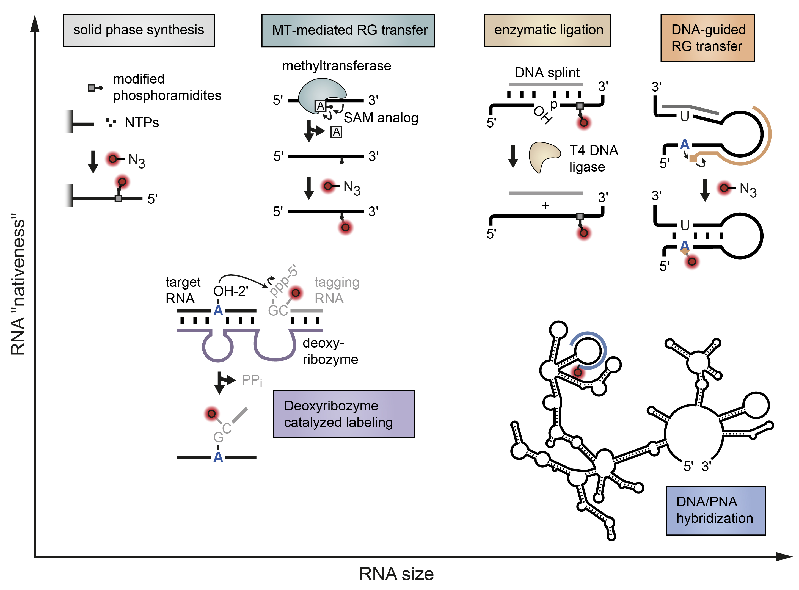
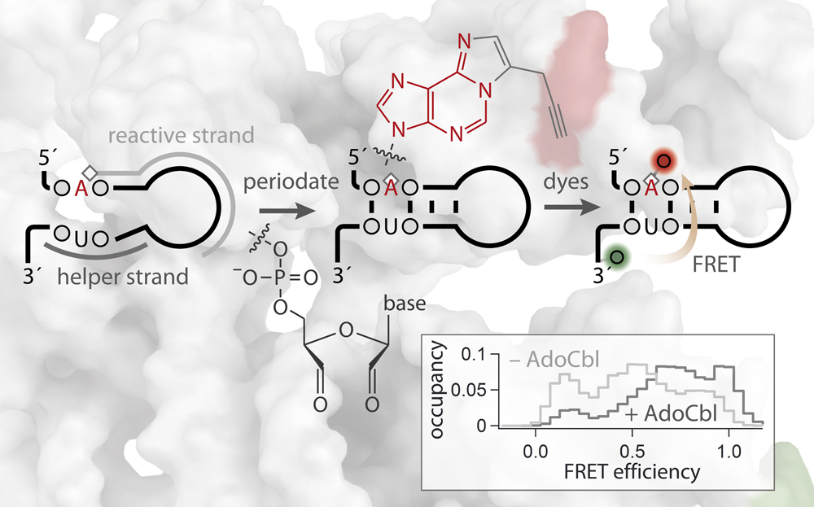

# Publications

## FRETlabel
F. D. Steffen, R. Börner, E. Freisinger, R. K. O. Sigel, *Chimia* (2019) 

!!! abstract "Stick, Flick, Click: DNA-guided Fluorescent Labeling of Long RNA for Single-molecule"
    <figure markdown>
        {width=600}
    </figure>

    Exploring the spatiotemporal dynamics of biomolecules on a single-molecule level requires innovative ways to make them spectroscopically visible. Fluorescence resonance energy transfer (FRET) uses a pair of organic dyes as reporters to measure distances along a predefined biomolecular reaction coordinate. For this nanoscopic ruler to work, the fluorescent labels need to be coupled onto the molecule of interest in a bioorthogonal and site-selective manner. Tagging large non-coding RNAs with single-nucleotide precision is an open challenge. Here we summarize current strategies in labeling riboswitches and ribozymes for fluorescence spectroscopy and FRET in particular. A special focus lies on our recently developed, DNA-guided approach that inserts two fluorophores through a stepwise process of templated functionality transfer and click chemistry. 

---

M. Zhao, F. D. Steffen, R. Börner, M. F. Schaffer, R. K. O. Sigel, *Nucleic Acids Res.* (2018) 

!!! abstract "Site-specific dual-color labeling of long RNAs for single-molecule spectroscopy"
    <figure markdown>
        {width=500}
    </figure>
    
    Labeling of long RNA molecules in a site-specific yet generally applicable manner is integral to many spectroscopic applications. Here we present a novel covalent labeling approach that is site-specific and scalable to long intricately folded RNAs. In this approach, a custom-designed DNA strand that hybridizes to the RNA guides a reactive group to target a preselected adenine residue. The functionalized nucleotide along with the concomitantly oxidized 3'-terminus can subsequently be conjugated to two different fluorophores via bio-orthogonal chemistry. We validate this modular labeling platform using a regulatory RNA of 275 nucleotides, the btuB riboswitch of Escherichia coli, demonstrate its general applicability by modifying a base within a duplex, and show its site-selectivity in targeting a pair of adjacent adenines. Native folding and function of the RNA is confirmed on the single-molecule level by using FRET as a sensor to visualize and characterize the conformational equilibrium of the riboswitch upon binding of its cofactor adenosylcobalamin. The presented labeling strategy overcomes size and site constraints that have hampered routine production of labeled RNA that are beyond 200 nt in length. 