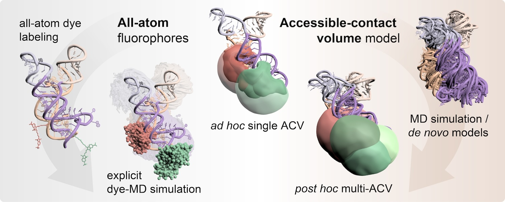
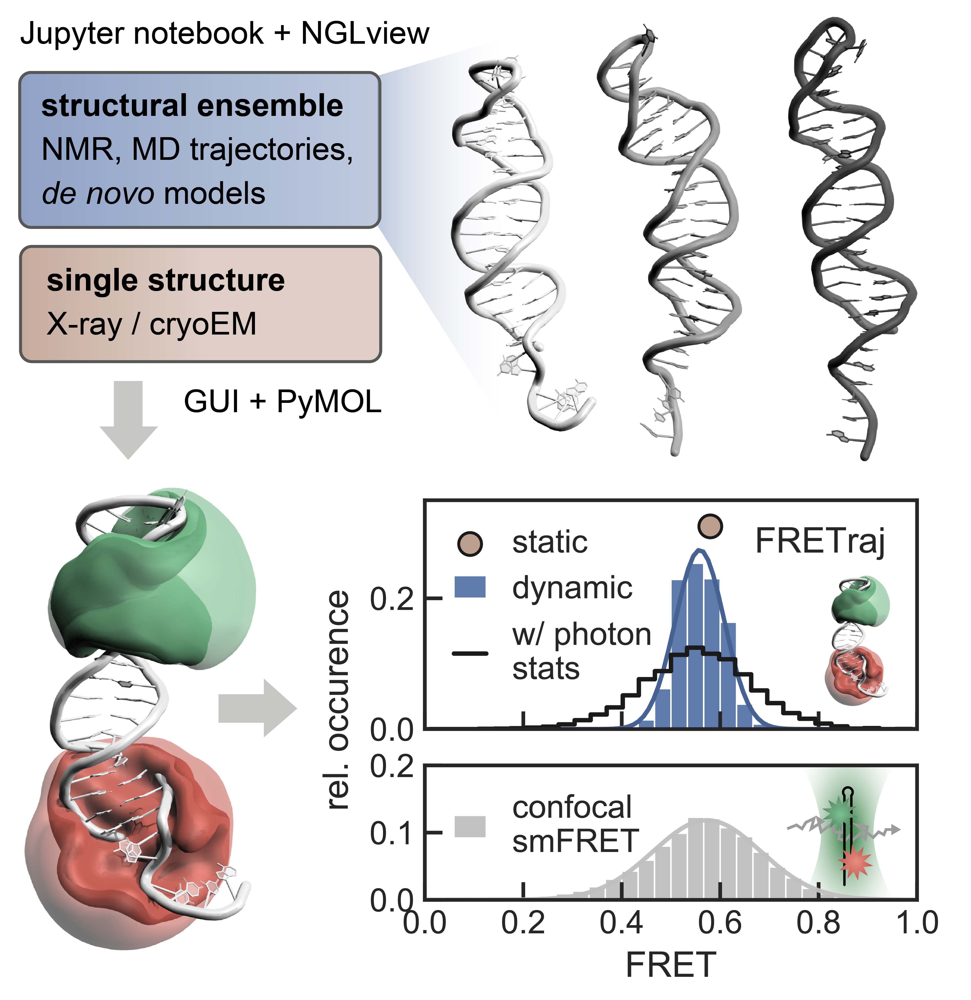

# Publications

## FRETraj
F. D. Steffen, R.A. Cunha, R. K. O. Sigel, R. Börner, *Nucleic Acids Research* (2024) 
!!! abstract "FRET-guided modeling of nucleic acids"
    <figure markdown>
        {width=450}
    </figure>

    The functional diversity of RNAs is encoded in their innate conformational heterogeneity. The combination of single-molecule spectroscopy and computational modeling offers new attractive opportunities to map structural transitions within nucleic acid ensembles. Here, we describe a framework to harmonize single-molecule Förster resonance energy transfer (FRET) measurements with molecular dynamics simulations and de novo structure prediction. Using either all-atom or implicit fluorophore modeling, we recreate FRET experiments in silico, visualize the underlying structural dynamics and quantify the reaction coordinates. Using multiple accessible-contact volumes as a post hoc scoring method for fragment assembly in Rosetta, we demonstrate that FRET can be used to filter a de novo RNA structure prediction ensemble by refuting models that are not compatible with in vitro FRET measurement. We benchmark our FRET-assisted modeling approach on double-labeled DNA strands and validate it against an intrinsically dynamic manganese(II)-binding riboswitch. We show that a FRET coordinate describing the assembly of a four-way junction allows our pipeline to recapitulate the global fold of the riboswitch displayed by the crystal structure. We conclude that computational fluorescence spectroscopy facilitates the interpretability of dynamic structural ensembles and improves the mechanistic understanding of nucleic acid interactions. 

F. D. Steffen, R. K. O. Sigel, R. Börner, *Bioinformatics* (2021) 
!!! abstract "FRETraj: integrating single-molecule spectroscopy with molecular dynamics"
    <figure markdown>
        {width=450}
    </figure>

    Quantitative interpretation of single-molecule FRET experiments requires a model of the dye dynamics to link experimental energy transfer efficiencies to distances between atom positions. We have developed FRETraj, a Python module to predict FRET distributions based on accessible-contact volumes (ACV) and simulated photon statistics. FRETraj helps to identify optimal fluorophore positions on a biomolecule of interest by rapidly evaluating donor-acceptor distances. FRETraj is scalable and fully integrated into PyMOL and the Jupyter ecosystem. Here, we describe the conformational dynamics of a DNA hairpin by computing multiple ACVs along a molecular dynamics trajectory and compare the predicted FRET distribution with single-molecule experiments. FRET-assisted modeling will accelerate the analysis of structural ensembles in particular dynamic, non-coding RNAs and transient proteinnucleic acid complexes. 
