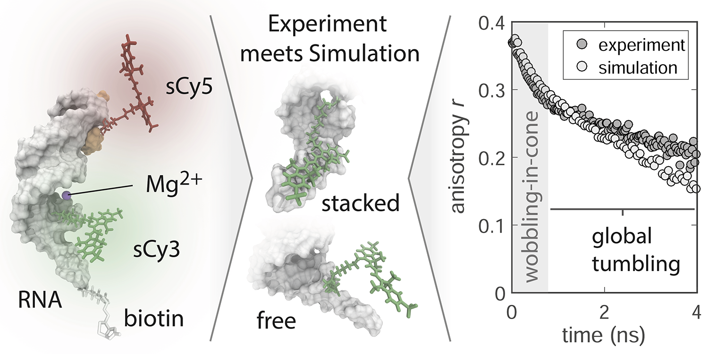

# Publications

## Lifefit

F. D. Steffen, R. K. O. Sigel, R. Börner, *Phys. Chem Chem. Phys* (2016) 

!!! abstract "An atomistic view on carbocyanine photophysics in the realm of RNA"
    <figure markdown>
        {width=550}
    </figure>
    
    Carbocyanine dyes have a long-standing tradition in fluorescence imaging and spectroscopy, due to their photostability and large spectral separation between individual dye species. Herein, we explore the versatility of cyanine dyes to probe the dynamics of nucleic acids and we report on the interrelation of fluorophores, RNA, and metal ions, namely K(+) and Mg(2+). Photophysical parameters including the fluorescence lifetime, quantum yield and dynamic anisotropy are monitored as a function of the nucleic acid composition, conformation, and metal ion abundance. Occasional excursions to a non-fluorescent cis-state hint at the remarkable sensitivity of carbocyanines to their local environment. Comparison of time-correlated single photon experiments with all-atom molecular dynamics simulations demonstrate that the propensity of photoisomerization is dictated by sterical constraints imposed on the fluorophore. Structural features in the vicinity of the dye play a crucial role in RNA recognition and have far-reaching implications on the mobility of the fluorescent probe. An atomic level description of the mutual interactions will ultimately benefit the quantitative interpretation of single-molecule FRET measurements on large RNA systems. 
