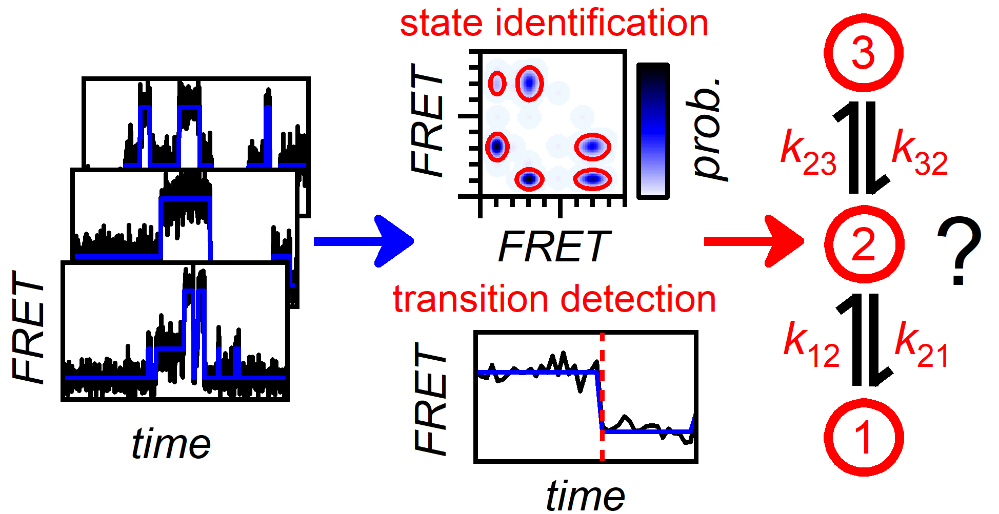
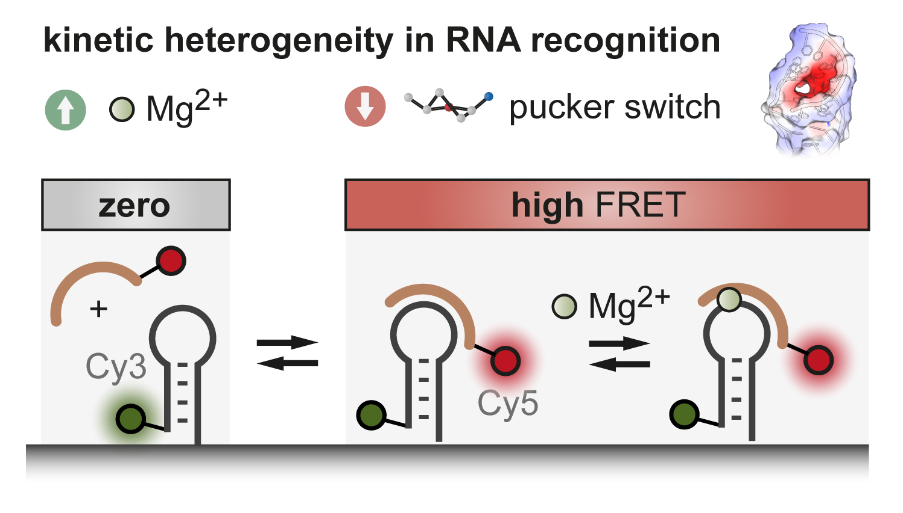
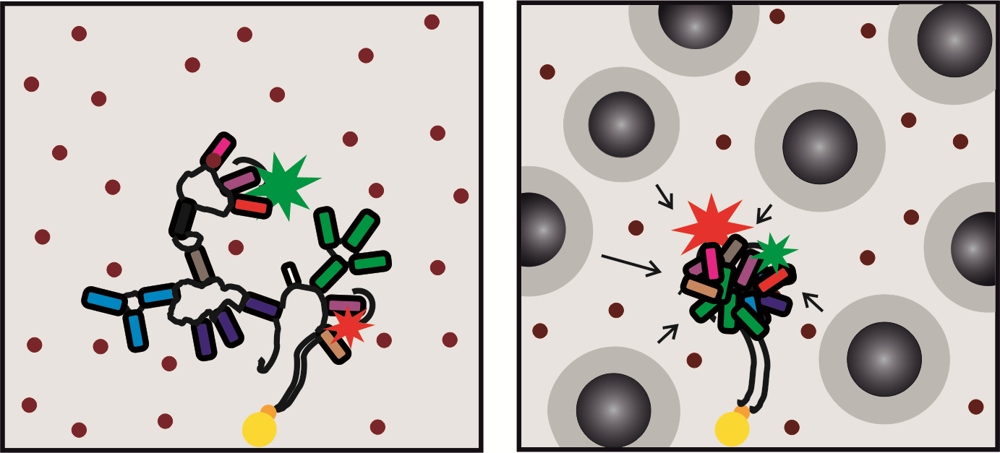

# Publications

## MASH-FRET

### Simulations and video processing
R. Börner, D. Kowerko, M.C.A.S. Hadzic, S.L.B. König, M. Ritter, R.K.O. Sigel, *PLoS One* (2018), *13*, e0195277. 

!!! abstract "Simulations of camera-based single-molecule fluorescence experiments"
    Single-molecule microscopy has become a widely used technique in (bio)physics and (bio)chemistry. A popular implementation is single-molecule Förster Resonance Energy Transfer (smFRET), for which total internal reflection fluorescence microscopy is frequently combined with camera-based detection of surface-immobilized molecules. Camera-based smFRET experiments generate large and complex datasets and several methods for video processing and analysis have been reported. As these algorithms often address similar aspects in video analysis, there is a growing need for standardized comparison. Here, we present a Matlab-based software (MASH-FRET) that allows for the simulation of camera-based smFRET videos, yielding standardized data sets suitable for benchmarking video processing algorithms. The software permits to vary parameters that are relevant in cameras-based smFRET, such as video quality, and the properties of the system under study. Experimental noise is modeled taking into account photon statistics and camera noise. Finally, we survey how video test sets should be designed to evaluate currently available data analysis strategies in camera-based sm fluorescence experiments. We complement our study by pre-optimizing and evaluating spot detection algorithms using our simulated video test sets. 

### Transition analysis
M.C.A.S. Hadzic, R. Börner, D. Kowerko, S.L.B. König, R.K.O. Sigel, *J. Phys. Chem. B* (2018) 

!!! abstract "Reliable State Identification and State Transition Detection in Fluorescence Intensity-Based Single-Molecule Förster Resonance Energy-Transfer Data"
    <figure markdown>
        {width=450}
    </figure>
    Single-molecule Förster resonance energy transfer (smFRET) is a powerful technique to probe biomolecular structure and dynamics. A popular implementation of smFRET consists of recording fluorescence intensity time traces of surface-immobilized, chromophore-tagged molecules. This approach generates large and complex data sets, the analysis of which is to date not standardized. Here, we address a key challenge in smFRET data analysis: the generation of thermodynamic and kinetic models that describe with statistical rigor the behavior of FRET trajectories recorded from surface-tethered biomolecules in terms of the number of FRET states, the corresponding mean FRET values, and the kinetic rates at which they interconvert. For this purpose, we first perform Monte Carlo simulations to generate smFRET trajectories, in which a relevant space of experimental parameters is explored. Then, we provide an account on current strategies to achieve such model selection, as well as a quantitative assessment of their performances. Specifically, we evaluate the performance of each algorithm (change-point analysis, STaSI, HaMMy, vbFRET, and ebFRET) with respect to accuracy, reproducibility, and computing time, which yields a range of algorithm-specific referential benchmarks for various data qualities. Data simulation and analysis were performed with our MATLAB-based multifunctional analysis software for handling smFRET data (MASH-FRET). 

### Histogram analysis and bootstrapping
S.L.B König, M.C.A.S. Hadzic, E. Fiorini, R. Börner, D. Kowerko, W. Blanckenhorn, R.K.O. Sigel, *Plos One* (2013) 

!!! abstract "BOBA FRET: Bootstrap-Based Analysis of Single-Molecule FRET Data"
    Time-binned single-molecule Förster resonance energy transfer (smFRET) experiments with surface-tethered nucleic acids or proteins permit to follow folding and catalysis of single molecules in real-time. Due to the intrinsically low signal-to-noise ratio (SNR) in smFRET time traces, research over the past years has focused on the development of new methods to extract discrete states (conformations) from noisy data. However, limited observation time typically leads to pronounced cross-sample variability, i.e., single molecules display differences in the relative population of states and the corresponding conversion rates. Quantification of cross-sample variability is necessary to perform statistical testing in order to assess whether changes observed in response to an experimental parameter (metal ion concentration, the presence of a ligand, etc.) are significant. However, such hypothesis testing has been disregarded to date, precluding robust biological interpretation. Here, we address this problem by a bootstrap-based approach to estimate the experimental variability. Simulated time traces are presented to assess the robustness of the algorithm in conjunction with approaches commonly used in thermodynamic and kinetic analysis of time-binned smFRET data. Furthermore, a pair of functionally important sequences derived from the self-cleaving group II intron Sc.ai5γ (d3’EBS1/IBS1) is used as a model system. Through statistical hypothesis testing, divalent metal ions are shown to have a statistically significant effect on both thermodynamic and kinetic aspects of their interaction. The Matlab source code used for analysis (bootstrap-based analysis of smFRET data, BOBA FRET), as well as a graphical user interface, is available via http://www.aci.uzh.ch/rna/.

### Applications
F. D. Steffen, M. Khier, D. Kowerko, R. A. Cunha, R. Börner, R. K. O. Sigel, *Nat. Commun.* (2020) 

!!! abstract "Metal ions and sugar puckering balance single-molecule kinetic heterogeneity in RNA and DNA tertiary contacts"
    <figure markdown>
        {width=450}
    </figure>
    The fidelity of group II intron self-splicing and retrohoming relies on long-range tertiary interactions between the intron and its flanking exons. By single-molecule FRET, we explore the binding kinetics of the most important, structurally conserved contact, the exon and intron binding site 1 (EBS1/IBS1). A comparison of RNA-RNA and RNA-DNA hybrid contacts identifies transient metal ion binding as a major source of kinetic heterogeneity which typically appears in the form of degenerate FRET states. Molecular dynamics simulations suggest a structural link between heterogeneity and the sugar conformation at the exon-intron binding interface. While Mg2+ ions lock the exon in place and give rise to long dwell times in the exon bound FRET state, sugar puckering alleviates this structural rigidity and likely promotes exon release. The interplay of sugar puckering and metal ion coordination may be an important mechanism to balance binding affinities of RNA and DNA interactions in general.

--- 

B. P. Paudel, E. Fiorini, R. Börner, R. K. O. Sigel, D. Rueda *PNAS* (2018) 

!!! abstract "Optimal molecular crowding accelerates group II intron folding and maximizes catalysis"
    <figure markdown>
        {width=450}
    </figure>
    Unlike in vivo conditions, group II intron ribozymes are known to require high magnesium(II) concentrations ([Mg2+]) and high temperatures (42 °C) for folding and catalysis in vitro. A possible explanation for this difference is the highly crowded cellular environment, which can be mimicked in vitro by macromolecular crowding agents. Here, we combined bulk activity assays and single-molecule Förster Resonance Energy Transfer (smFRET) to study the influence of polyethylene glycol (PEG) on catalysis and folding of the ribozyme. Our activity studies reveal that PEG reduces the [Mg2+] required, and we found an {\textquotedbl}optimum{\textquotedbl} [PEG] that yields maximum activity. smFRET experiments show that the most compact state population, the putative active state, increases with increasing [PEG]. Dynamic transitions between folded states also increase. Therefore, this study shows that optimal molecular crowding concentrations help the ribozyme not only to reach the native fold but also to increase its in vitro activity to approach that in physiological conditions.

---

R. Börner, D. Kowerko, H. Guiset Miserachs, M. F. Schaffer, R. K. O. Sigel, *Coord Chem Rev.* (2016) 

!!! abstract "Metal ion induced heterogeneity in RNA folding studied by smFRET"
    More than two decades of investigating nucleic acids and ribonucleic acids (RNA) using single molecule Förster resonance energy transfer (smFRET) have passed. It turned out that sample heterogeneity in structure and function of RNA molecules as well as folding intermediates, kinetic subpopulations, and interconversion rates of conformational states of RNA biomolecules, all of which are usually hidden in ensemble type experiments, are often observed characteristics. Besides proteins, metal ions play a crucial role in RNA folding and dynamics, as well as RNA/RNA or RNA/DNA interactions. RNA molecules form discrete conformational intermediates before reaching the native three-dimensional fold, whereby metal ions guide the folding pathway by changing the energetic barriers between local and global minima in the energy landscape. Here we review recent advances in the characterization of the role of metal ions in folding and function of nucleic acid structures by means of smFRET. Subsequently, the workflow of smFRET data analysis is described and exemplified by the metal ion-depending folding and dynamics of the group IIB intron from Saccharomyces cerevisiae and RNA–RNA binding kinetics of this ribozyme's 5'-splice site formation.
