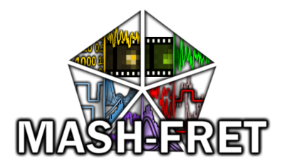

# Software

We have developed a series of open-source software packages for analysis and prediction of single-molecule experiments aiming to **integrate FRET with molecular simulations**.

## MASH-FRET
{align=right width=170}
*MASH-FRET* analyzes experimental and synthetic single-molecule microscopy videos with automated molecule sorting. It implements the entire workflow of image-based, single-molecule data analysis including trace processing, histogram building and bootstrapping.

[:material-github: Github](https://github.com/RNA-FRETools/MASH-FRET){.md-button}
[:material-file-document: Documentation](https://rna-fretools.github.io/MASH-FRET/){.md-button}

---

## FRETraj
{align=right width=120}
By calculating multiple fluorophore accessible-contact volumes (ACV) along a molecular dynamics trajectory, *FRETraj* predicts transfer efficiency distributions that help to interpret single-molecule experiments.

[:material-github: Github](https://github.com/RNA-FRETools/fretraj){.md-button}
[:material-file-document: Documentation](https://rna-fretools.github.io/fretraj/){.md-button}

---

## FRETlabel
{align=right width=120}
*FRETlabel* couples fluorescent dyes to your nucleic acid of interest using common chemical conjugation chemistries. 

[:material-github: Github](https://github.com/RNA-FRETools/fretlabel){.md-button}
[:material-file-document: Documentation](https://rna-fretools.github.io/fretlabel/){.md-button}

---

## Lifefit
{align=right width=130}

*Lifefit* uses iterative reconvolution fitting to analyze fluorescent lifetime and dynamic anisotropy decays.

[:material-github: Github](https://github.com/RNA-FRETools/Lifefit){.md-button}
[:material-file-document: Documentation](https://lifefit.readthedocs.io/en/latest/){.md-button}